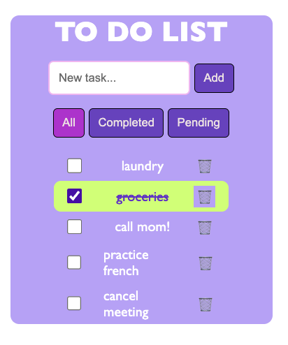

# 🧠 Ejercicio: Lista Interactiva de Tareas (To-Do List con Filtros)


## 💻 Resultado



## 🎯 Objetivo

Crear una aplicación web sencilla de lista de tareas, donde puedas:

- Añadir tareas
- Marcar tareas como completadas
- Filtrar entre tareas: **Todas**, **Completadas** y **Pendientes**
- Eliminar tareas
- Usar los eventos del navegador y manipulación del DOM para lograr todo esto sin librerías externas

---

## 📝 Requisitos funcionales

1. **Formulario para añadir tarea**
   - Input de texto + botón “Agregar”
   - Al enviar, se crea una nueva entrada en la lista de tareas

2. **Cada tarea debe:**
   - Mostrarse con un `checkbox` para marcarla como completada
   - Tener un botón para eliminarla
   - Cambiar visualmente cuando esté completada (por ejemplo, tachado o cambio de color)

3. **Filtros**
   - Tres botones: **Todas**, **Completadas**, **Pendientes**
   - Al hacer clic en un botón, la lista debe mostrar solo las tareas correspondientes
   - El botón activo debe resaltarse visualmente (usando clases CSS)

---

## 🔧 Requisitos técnicos

Debes utilizar:

- `document.querySelector`, `getElementById`, `getElementsByClassName`, etc. para seleccionar elementos
- Eventos como:
  - `click` (en botones, checkboxes)
  - `submit` (en el formulario)
- Propiedades como `.checked`, `.classList`, `.value`, `.dataset`, etc.
- Creación de elementos del DOM dinámicamente (`createElement`, `append`, `prepend`, etc.)
- Acceso o modificación de atributos HTML (`id`, `class`, `type`, etc.)

---

## 🖼️ Estructura HTML sugerida

```html
<div id="app">
  <h1>Lista de Tareas</h1>

  <form id="task-form">
    <input type="text" id="task-input" placeholder="Nueva tarea..." required />
    <button type="submit">Agregar</button>
  </form>
  <br/>
  <div id="filters">
    <button data-filter="all" class="active">Todas</button>
    <button data-filter="completed">Completadas</button>
    <button data-filter="pending">Pendientes</button>
  </div>

  <ul id="task-list"></ul>
</div>
```
